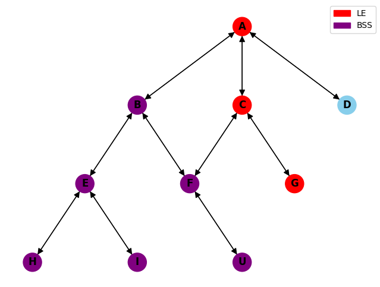

<h1 align="center">
  Backtracking
</h1>

## 📚 Projeto

Algoritmo desenvolvido para a disciplina de Inteligência Artificial da Uni7. O algoritmo irá partir do grafo A e tentará chegar ao grafo G. Caso encontre, pinta o caminho percorrido de vermelho e mensagem de objetivo encontrado, caso não encontre, retorna mensagem de objetivo não encontrado.

## 💼 Tecnologias utilizadas

Para o desenvolvimento deste site utilizei as seguintes tecnologias:

- Python;
- Matplotlib;
- NetworkX.

## 🔧 Arquitetura

Para criar o grafo, utilizei uma classe (Grafo) que implementa um dicionário, onde nele é armazenado o vértice e os vértices para qual ele possui arestas. A classe Grafo possui uma função (getVizinhos) para pegar os vértices para qual determinado vértice possui arestas, e outra função (excluiRep) que utiliza o resultado da função getVizinhos como parâmetro, para excluir os vértices que já estão em LE, LNE e BSS. A lógica segue como a vista em sala de aula.

Também utilizei duas bibliotecas do python, o matplotlib e networkx, para exibir o grafo em tela e mostrar o algoritmo percorrendo pelos vértices durante sua execução.
